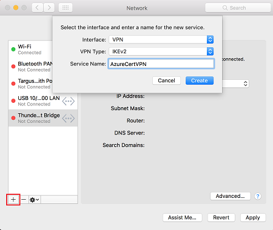
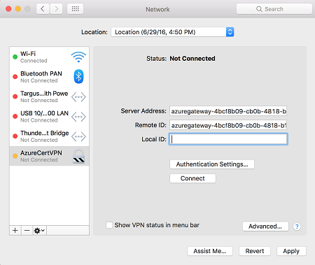
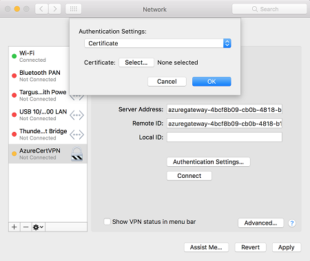

# Setup Point to Site VPN Connection to Azure

## Generate Client Certificate

```
export USERNAME=YOUR_USER_HERE
openssl genrsa -out ${USERNAME}.key 2048
openssl req -new -key ${USERNAME}.key -out ${USERNAME}.csr
```

You’ll get questions but your answers don’t matter, except you should put "Common Name", which is used later.

Example:

```
Country Name (2 letter code) [AU]:DE
State or Province Name (full name) [Some-State]:Bayern
Locality Name (eg, city) []:Muenchen
Organization Name (eg, company) [Internet Widgits Pty Ltd]:KI labs
Organizational Unit Name (eg, section) []:
Common Name (e.g. server FQDN or YOUR name) []:tiexin
Email Address []:t.guo@kigroup.de
```

Then convert the format into .p12:

```
openssl pkcs12 -export -out ${USERNAME}.p12 -inkey ${USERNAME}.key -in ${USERNAME}.crt
```

## Install Your Root Certificate

We need to add the root certificate to any laptops, desktops, tablets, and phones that will be using point-to-site VPN. This can be a bit of a pain, but the good news is that we only have to do it once. Once our root certificate is on each device, it will be good until it expires.

Adding the Root Certificate to macOS Keychain

- Open the macOS Keychain app
- Unlock login keychain if you haven't done so, mac password needed
- Go to File > Import Items…
- Select the private key file (rootCA.crt)
- Double click on the newly imported file
- Expand the Trust section
- Change the When using this certificate: select box to “Always Trust”
- Close the certificate window
- It will ask you to enter your mac password, do that

## Install Your Certificate

- Open the macOS Keychain app
- Go to File > Import Items…
- Select the private key file (${USERNAME}.p12)

## Create VPN Connection for Mac OS

Open the Network dialog under Network Preferences and click '+' to create a new VPN client connection profile for a P2S connection to the Azure VNet.

The Interface value is 'VPN' and VPN Type value is 'IKEv2'. Specify a name for the profile in the Service Name field, then click Create to create the VPN client connection profile.



Download vpn settings from Azure - Virtual network gateways - select your gateway - Point-to-site configuration - Download VPN client.

Then unzip, and from the VpnSettings.xml file, copy the VpnServer tag value. Paste this value in the Server Address and Remote ID fields of the profile.



Click Authentication Settings and select Certificate.



Click Select… to choose your certificate created above, then continue.

In the Local ID field, specify the name of the certificate. In this example, it is my Common Name when I create the certificate: "tiexin". Then, click Apply button to save the changes.

On the Network dialog, click Apply to save all changes. Then, click Connect to start the P2S connection to the Azure VNet.
